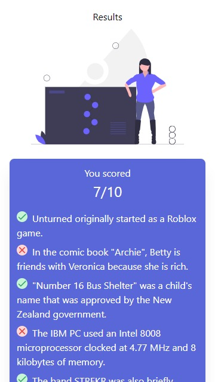
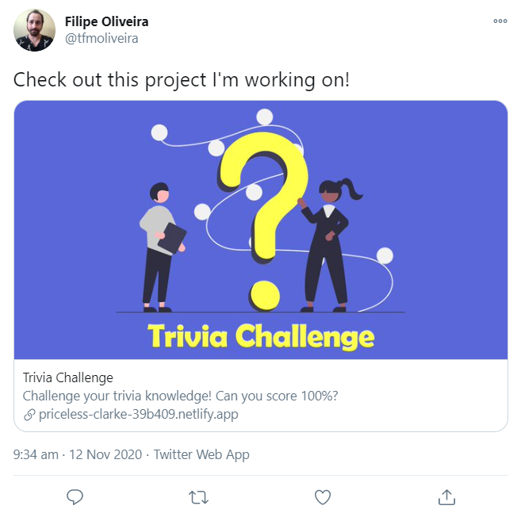

# Trivia Challenge

**Trivia Challenge** is a trivia application - a quick game in which you can test your general trivia knowledge. Each round shows 10 true/false questions loaded from [Open Trivia Database](https://opentdb.com/) on all categories of subjects.

Check out this demonstration of the results page:

## Installation

This project requires Node.js version 12 (maintenance LTS) or 14 (current LTS). It should also work fine with version 15, although it's recommended to use one of the supported LTS versions.

Installation steps:

- Clone the repository
- Run `yarn` to install the dependencies
- Run `yarn start` to run the project
- Open the URL displayed in your console to use the application

## Deployment

This project can be deployed to any static hosting service. If you're unsure where to deploy it, give [Netlify](https://www.netlify.com/) a try.

Deployment steps:

- Define the environment variable `PUBLIC_URL` to the absolute URL where the application will be accessible, for example, https://your-name-15c00l.netlify.app
- Configure the build step to run the command `yarn build`
- Configure the publish step to use the files from the `build` directory

### URL Rewrite

Depending on the hosting service you use, you may need to configure a URL rewrite of any not found URLs to the index.html file to make sure the routing of this Single Page Application will work as expected. If you're going to use Netlify, you don't need to worry about that because this rewrite is already preconfigured in the repository.

### OpenGraph Image

The application will work fine without extra configuration, but it's recommended to define the environment `PUBLIC_URL` for better aesthetics. This environment variable is necessary for the OpenGraph Image to be accessed correctly because consumers will require it to be an absolute URL. This image is displayed whenever you share the published URL on instant messengers or social networks.

Check out this simulation of how the application URL will look like on Twitter:

## Technical Decisions

### Functionality

The core functionality runs in the `Quiz` page, and all of its functionality is co-located with its page component.

The data is managed with [React Query](https://react-query.tanstack.com/) because it's a small and stable state management library that's also powerful enough to be used in larger projects, especially with REST APIs (which is our case) but also a possible way to get started with GraphQL APIs. If GraphQL usage becomes predominant in the project, it's recommended to swap React Query for [Apollo Client](https://www.apollographql.com/docs/react/).

The business logic is executed with [XState](https://xstate.js.org/docs/) where the business logic state is also stored. It's recommended to use the [XState DevTools](https://chrome.google.com/webstore/detail/xstate-devtools/aamnodipnlopbknpklfoabalmobheehc?hl=en) browser extension if you want to visualize the state chart directly in your development browser.

### Code Format

The source code is formatted with [Prettier](https://prettier.io/), an opinionated code formatter. It's optional to install the editor extension, but Prettier will always be executed before you commit any code to make sure that everything is formatted to the project standards.

Linting with ESLint is executed by `react-scripts` and you can check the [configuration here](https://github.com/facebook/create-react-app/tree/master/packages/eslint-config-react-app). The [configuration can be extended](https://create-react-app.dev/docs/setting-up-your-editor/#extending-or-replacing-the-default-eslint-config) if needed.

### Project Structure

All context providers should be registered on `App.tsx` for consistency, while all routing should be setup on `Routes.tsx`. If we start adding several new routes, then we should reevaluate and think about creating modular route files.

Everything else should be structured in the following folders inside `src`:

- `components`: reusable components without any bindings with requests or business logic
- `pages`: containers used to connect `components` with `api` and business logic

#### components

Reusable components without any bindings with network requests or business logic. For a larger project, we would split this folder into an extra library for the design system components, while leaving only application-specific components at this folder and composing them from the design system library.

#### pages

Pages are components rendered into a route. They are always placed under a folder that may additionally include business logic and integration tests. They should always be built using these fundamental semantic components:

- `Layout`: defines whether the page uses the primary or secondary layout
- `Header`: defines the title displayed in the document title and at the top of the page, and also allows adding an image at the top of the page
- `Content`: defines the correct layout for placing content

We should never define any styles inside this folder because it would increase the cost and complexity of maintaining a consistent design system across the application. Instead, create new components in the `components` folder and use them inside `pages`.

It's ok to use the `Stack` component inside pages but use it sparingly. If you're using it often, try to create an abstraction on `components` that makes it simpler to write layouts. For example, take a look at how all the semantic components mentioned above have a `Stack` baked inside them - this makes the layouts consistent across all pages while keeping the API simple.

Business logic should almost always be placed inside a page folder, but never inside a page component. Move it to an external function that may or may not be a hook, as applicable. For a larger project, it could make sense to split all the business logic into an extra library to decouple it completely from the application and make it simpler to reuse it.

#### utils

Tiny utility functions will be placed here. This folder should not be overused, ideally, we should have a small number of functions living here. Putting tens or hundreds of utilities would make it a hurdle to maintain potentially unused code. Use stable and well-tested third-party libraries when possible, always paying attention to bundle size and project maintainability.

### Scalability & Maintainability

It's highly recommended to keep the directory structure as flat as it is right now. The experience of the React community shows that projects with a lot of directory nesting will quickly become daunting to maintain.

Any resources necessary by a page should be co-located in the same folder as that page. For example, network requests and business rules should be put in different files but at the same folder that they will be used. Co-locating these files make it quicker to find them, simplifying the maintenance process.

The current structure is simple enough to onboard new team members quickly as well as to former team members to add new features productively. These two productivity feelings should always be accounted for whenever the structure is going to be modified.

For larger projects, the following technical decisions should be evaluated:

- Extract UI components into a separate library to enforced decoupling, it doesn't need to make into a formal design system, but simply decoupling it will simplify future updates
- Extract business logic into a separate library to enforced decoupling, this will also allow the business rules to be shared with backends and also be developed by people without React experience
- Setup Apollo Client for consuming GraphQL APIs

## Credits

The application design was inspired by a particular set of mockups available publicly on Dribbble. The illustrations, icons, and loader are all open source. You can check out more about them in the links below.

- Design inspired on [Travel Questionnaire App](https://dribbble.com/shots/9809046-Travel-Questionnaire-App) by [Simona Vorlova](https://dribbble.com/SimonaVorlova)
- Illustrations by [unDraw](https://undraw.co/)
- Icons by [Material Design](https://material.io/resources/icons/?icon=done&style=baseline)
- Loader by [Nobuaki Honma](https://codepen.io/rbv912/pen/dYbqLQ)
